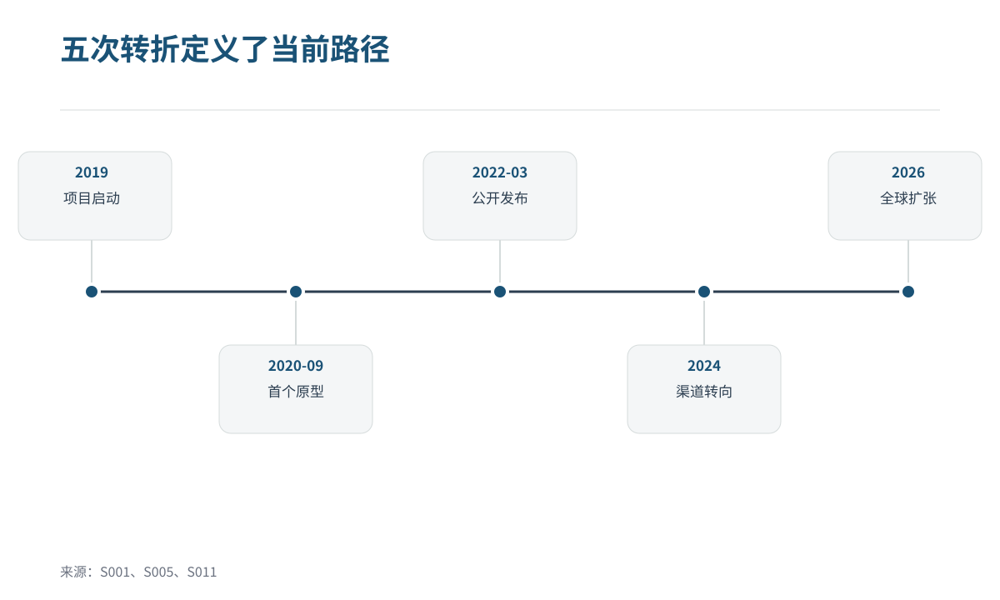
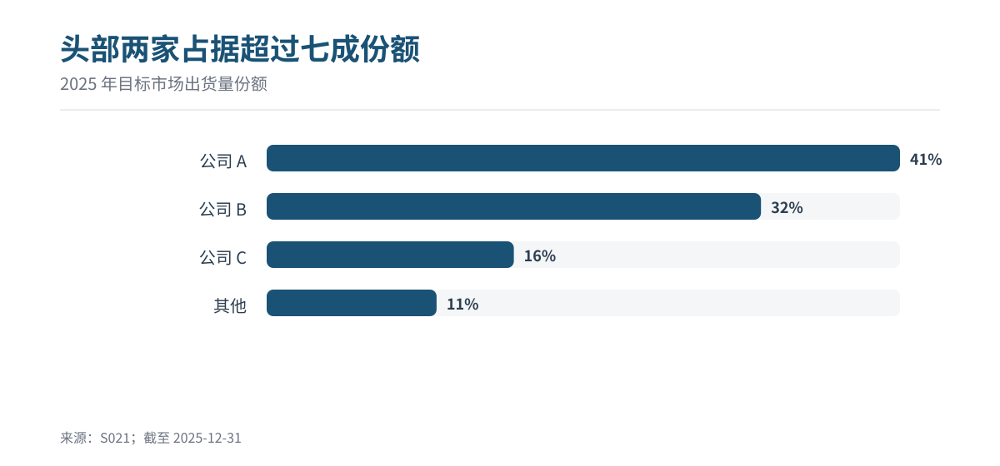
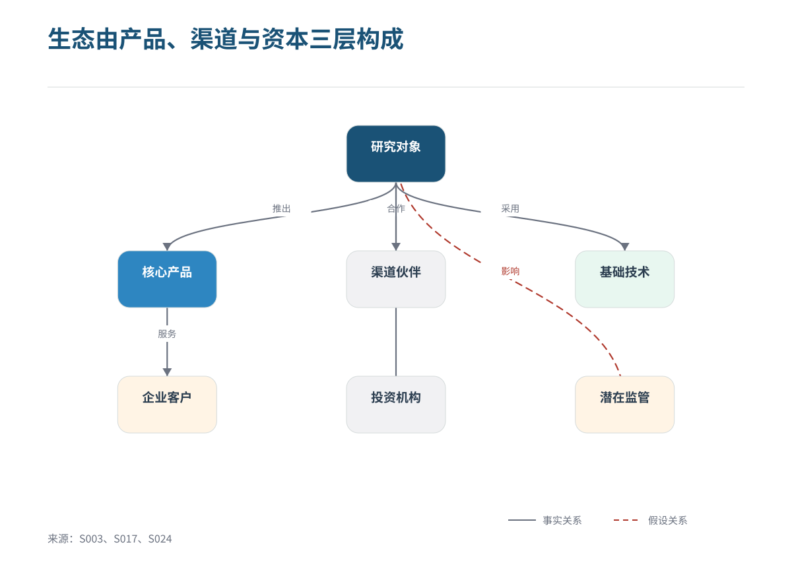

# orthogonal-research-skill

**面向 Codex 的可审计中文深度研究 Skill**

围绕对象的历史演进、竞争格局和证据链，生成可复核的中文研究报告与 PDF。

## 适用场景

当任务需要系统研究一个产品、公司、技术、概念、行业或人物时使用，例如：

- 还原起源、版本、关键决策、组织变化和当前状态；
- 比较竞品、替代方案、价格、用户口碑和生态位置；
- 对重要事实保留来源、口径、时间和不确定性；
- 交付带图表、知识图谱、编号引用和 PDF 的中文研究报告。

不适合两三句即可回答的简单释义、单一事实查询、纯摘要或无证据观点文。

## 核心能力

| 模块 | 能力 |
| --- | --- |
| 研究协议 | 纵向演进、横向竞争、全球检索、来源优先级和证据闸门 |
| 证据管理 | 来源 ID、来源台账、研究日志、引用映射、冲突与限制披露 |
| 分析框架 | 纵向时间线、横向竞品比较、横纵交汇判断和情景分析 |
| 可视化 | 时间线、柱状图、折线图、环形图、矩阵和知识图谱 SVG |
| 报告交付 | 中文 Markdown、HTML 调试稿、自包含 PDF 和逐项构建日志 |
| 质量控制 | 反方审查、回归矩阵、跨平台自检和 PDF 构建校验 |

## 工作流

~~~text
建立研究工作区
        ↓
联网收集海内外证据
        ↓
纵向演进 + 横向竞争
        ↓
横纵交汇与反方审查
        ↓
可视化、写作、PDF 构建
        ↓
逐项验收并交付研究包
~~~

## 输出预览

以下图片由仓库内置渲染脚本根据样例数据生成。

  

  
  

## 快速安装

### 方式一：使用 Codex skill 安装器

在 Codex 中执行：

~~~text
使用 $skill-installer 从
https://github.com/Rolling-Log/orthogonal-research-skill/tree/main/orthogonal-research-skill
安装这个 skill。
~~~

### 方式二：Git clone + 一键安装

仓库根目录包含 README、许可证和 CI；可安装的 skill 本体位于 <code>orthogonal-research-skill/</code> 子目录。安装脚本会把它复制到 Codex 的 skills 目录。

#### macOS / Linux

~~~bash
git clone --depth 1 https://github.com/Rolling-Log/orthogonal-research-skill.git && ./orthogonal-research-skill/install.sh
~~~

#### Windows PowerShell

~~~powershell
git clone --depth 1 https://github.com/Rolling-Log/orthogonal-research-skill.git; if ($LASTEXITCODE -eq 0) { & .\orthogonal-research-skill\install.ps1 }
~~~

默认安装位置：

~~~text
$CODEX_HOME/skills/orthogonal-research-skill
~~~

如果没有设置 <code>CODEX_HOME</code>，则使用 <code>~/.codex/skills/orthogonal-research-skill</code>。目标目录已存在时，安装脚本会停止且不会覆盖文件。

安装完成后，目标目录中应直接包含 <code>SKILL.md</code>、<code>agents/</code>、<code>assets/</code>、<code>references/</code>、<code>scripts/</code> 和 <code>vendor/</code>。

## 使用示例

在 Codex 中提出明确的研究对象和边界：

~~~text
使用 $orthogonal-research-skill 研究某产品的起源、版本路线、主要竞品、用户口碑和未来风险，交付中文 PDF 报告。
~~~

如果用户没有指定输出目录，skill 会创建带时间戳的研究工作区，并将报告、来源、数据、图片、图表、构建日志和 PDF 保存在同一个研究包中。

## 目录结构

~~~text
orthogonal-research-skill/
├── SKILL.md                    # 触发条件与完整工作流
├── agents/openai.yaml          # Codex UI 名称和默认提示
├── references/                 # 研究协议、报告规范和验收规则
├── scripts/                    # 初始化、渲染、构建和校验脚本
├── assets/                     # 字体、样例、样式和许可证
└── vendor/reportlab/           # PDF 构建所需的精简依赖
~~~

## 本地验证

在仓库根目录执行：

~~~bash
python orthogonal-research-skill/scripts/check_package.py
python orthogonal-research-skill/scripts/init_workspace.py --self-test
python orthogonal-research-skill/scripts/build_report.py --self-test
~~~

GitHub Actions 会在 macOS 和 Windows 上验证安装脚本，并使用 Python 3.9 与 3.12 运行同一组包与 PDF 检查。

## 许可证与第三方依赖

原创内容使用 MIT License。内置 ReportLab 代码和 Source Han Sans CN 字体保留各自上游许可证，详见 [THIRD_PARTY_NOTICES.md](THIRD_PARTY_NOTICES.md) 和 [assets/licenses](orthogonal-research-skill/assets/licenses/)。

研究报告使用的外部网页、图片和数据仍由各自权利人负责；请在研究包中记录来源、许可和访问日期。
