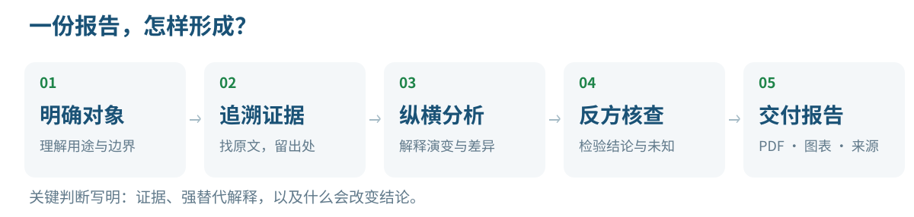
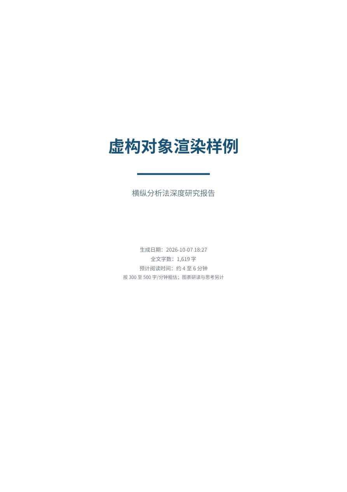
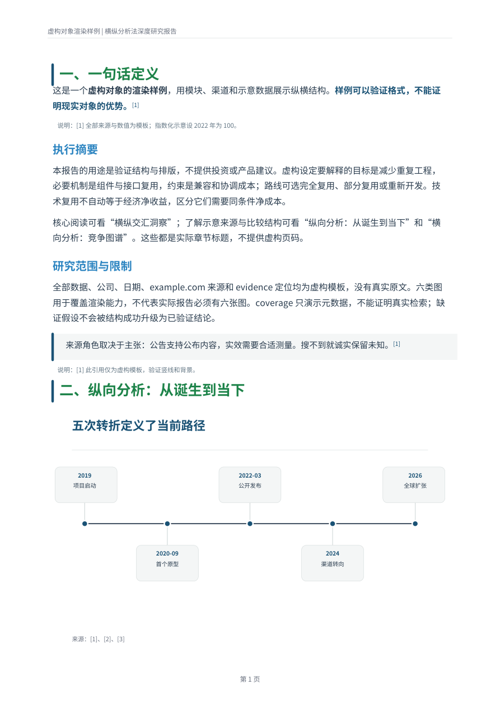
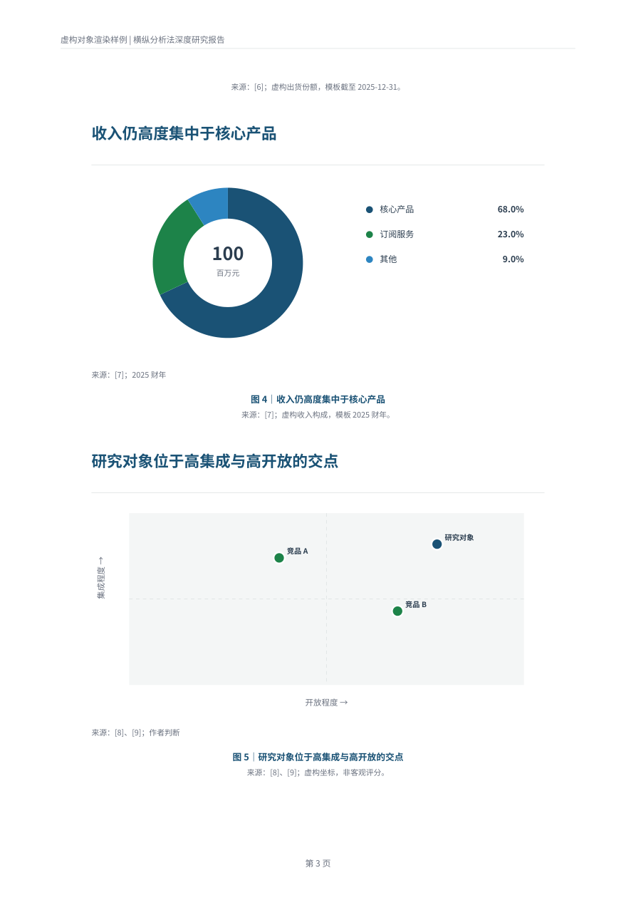
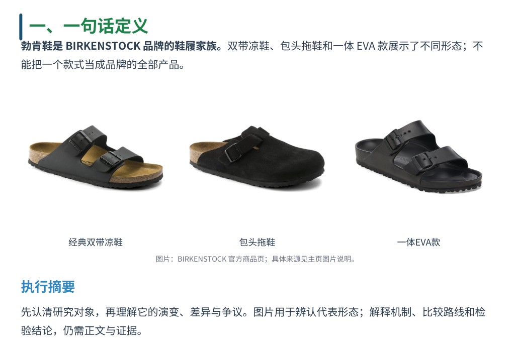
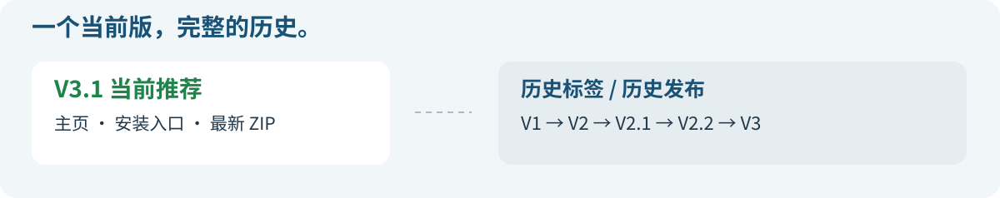

<div align="center">


[](https://github.com/Rolling-Log/orthogonal-research-skill/releases/latest)
[](https://github.com/Rolling-Log/orthogonal-research-skill/actions/workflows/orthogonal-research-skill.yml)
[](LICENSE)

**帮助刚进入陌生领域的人，系统理解一个产品、公司、行业、技术或概念。**

### [↓ 下载最新版 · 只含一份 Skill](https://github.com/Rolling-Log/orthogonal-research-skill/releases/latest/download/orthogonal-research-skill.zip)

[开始使用](#开始使用) · [V3.1 更新](CHANGELOG.md) · [查看旧版](https://github.com/Rolling-Log/orthogonal-research-skill/releases)

</div>

## 怎样研究



**纵向**解释它怎样走到今天；**横向**比较当下路线与替代；**交汇**解释历史选择如何形成今天的优势和限制。

## 报告长什么样

<table>
  <tr><th>封面 · 字数与阅读时间</th><th>正文 · 判断与来源</th><th>图表 · 看清差异</th></tr>
  <tr>
    <td><a href="docs/images/sample-page-1.png"></a></td>
    <td><a href="docs/images/sample-page-2.png"></a></td>
    <td><a href="docs/images/sample-page-4.png"></a></td>
  </tr>
</table>

以上是内置**虚构样例的实际渲染**，用于展示版式；点击可看大图。研究交付包含 PDF、可编辑原稿、来源台账和审查记录。

### V3.1：先看到研究对象，再进入摘要



勃肯鞋版式示例。优先一张代表图片；必要时用 **2–4 张横排**，每张说明 **≤10 字**。给图片正常展示空间，后文自然下移。[图片来源](docs/IMAGE_CREDITS.md)

## 开始使用

将这段话发给 Codex：

```text
使用 $skill-installer 从下面的仓库路径安装最新版本：
https://github.com/Rolling-Log/orthogonal-research-skill/tree/main/orthogonal-research-skill
```

也可以下载上方 ZIP，将里面的 `orthogonal-research-skill` 文件夹放入 `~/.codex/skills/`；已设置 `CODEX_HOME` 时放入其 `skills/`。已有旧版时先移出并保留，再放入新版，同名版本只启用一份。

安装后直接说：

```text
用纵横调研研究勃肯鞋。我想全面认识它的产品、历史、品牌商业与争议，交付中文报告和 PDF。
```

有具体工作用途就一起说明；暂时不清楚重点，也可以先建立全面认识。简单释义、单一事实和纯摘要不必启动完整流程。

## 版本与下载



| 当前使用 | 追溯历史 |
|---|---|
| [最新 ZIP](https://github.com/Rolling-Log/orthogonal-research-skill/releases/latest/download/orthogonal-research-skill.zip) · [校验值](https://github.com/Rolling-Log/orthogonal-research-skill/releases/latest/download/SHA256SUMS.txt) | [各版本说明](CHANGELOG.md) · [所有标签](https://github.com/Rolling-Log/orthogonal-research-skill/tags) |

默认分支只保留当前 skill；发布 ZIP 不包含旧版、测试档案和主页素材。GitHub 的 **Code → Download ZIP** 是当前仓库快照，也不包含旧版本目录，但会包含主页文字与安装脚本；安装请优先使用上方最新 ZIP。

<details>
<summary>维护与校验</summary>

```bash
python orthogonal-research-skill/scripts/check_package.py
python orthogonal-research-skill/scripts/init_workspace.py --self-test
python orthogonal-research-skill/scripts/build_report.py --self-test
python -m unittest discover -s tests -v
python tools/package_release.py
```

CI 在 macOS / Windows、Python 3.9 / 3.12 上运行。结构校验和 PDF 渲染通过只说明对应检查通过，研究结论仍需原文核验与实质反方审查。

</details>

原创内容采用 [MIT](LICENSE)；字体和内置依赖保留各自许可，见 [第三方说明](THIRD_PARTY_NOTICES.md)。研究素材与品牌图片不属于本项目的 MIT 授权范围。
