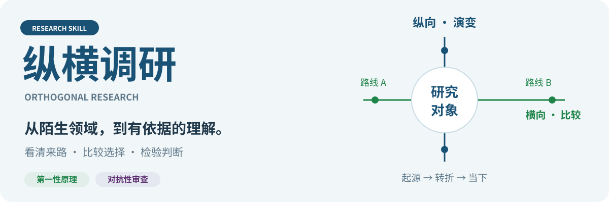
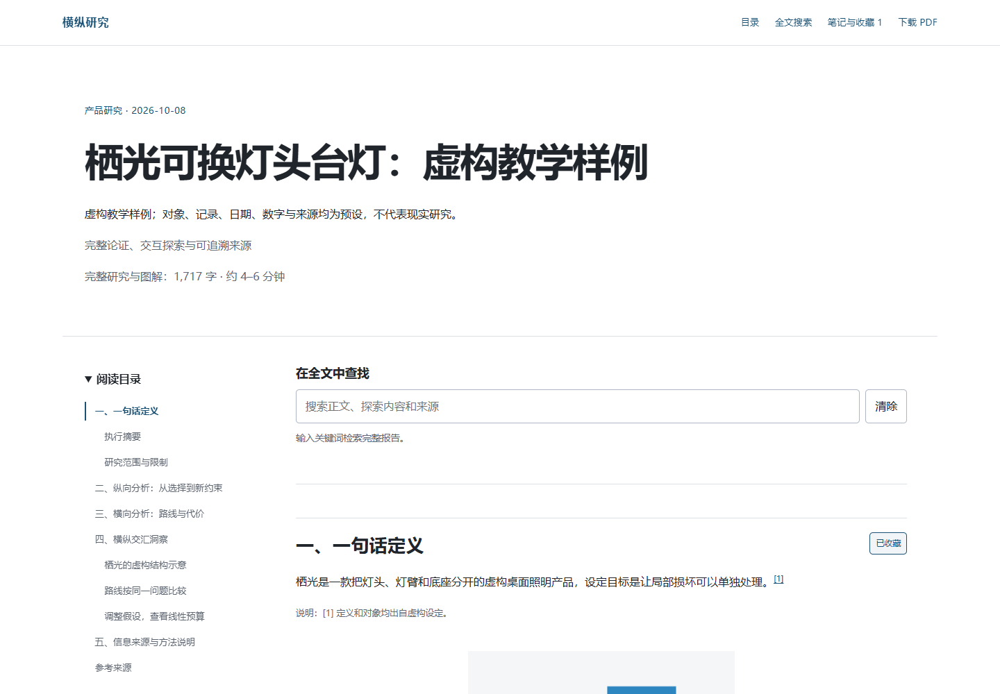
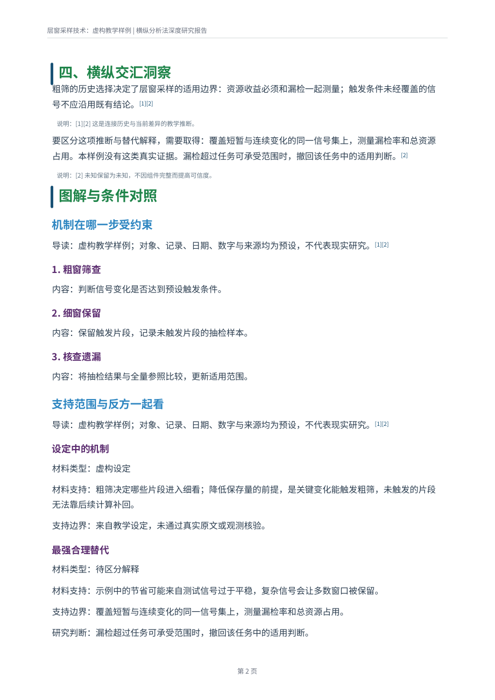
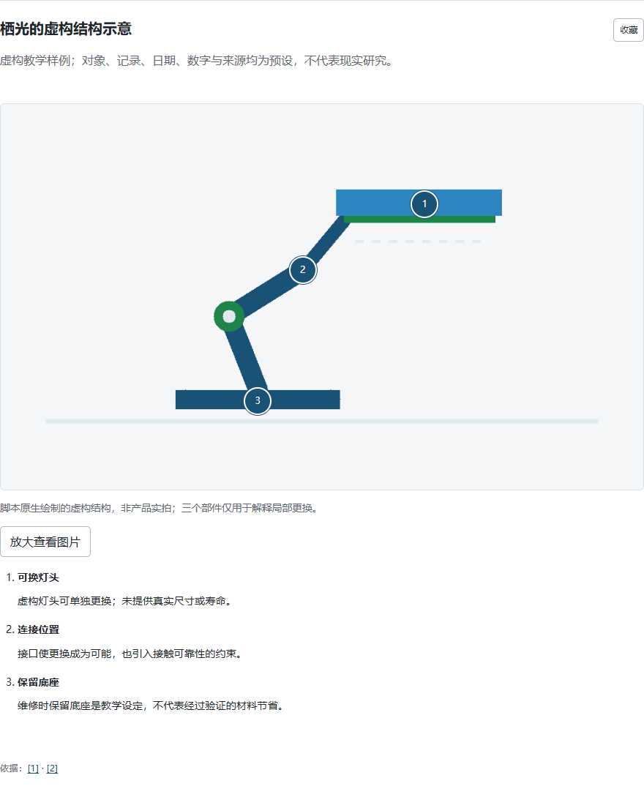
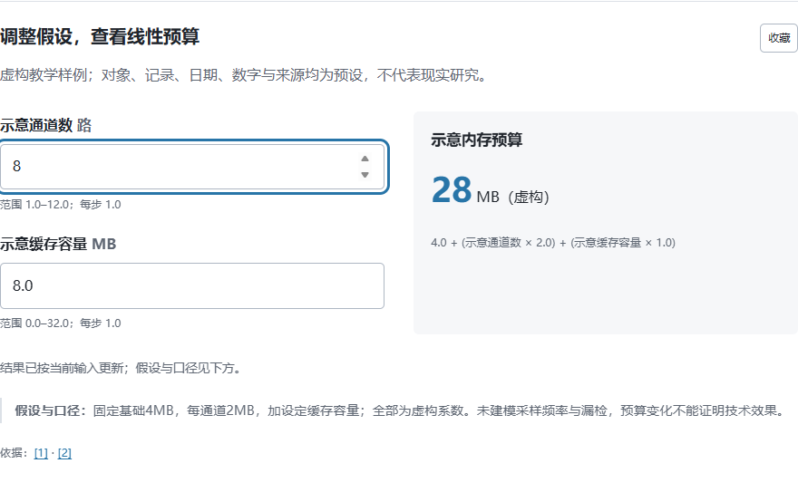
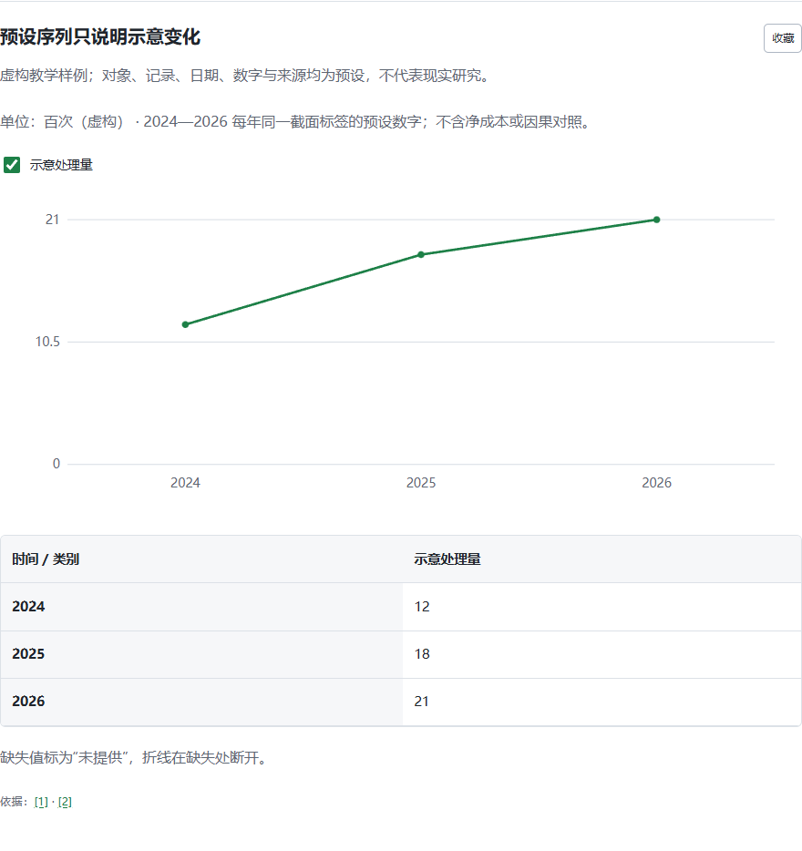
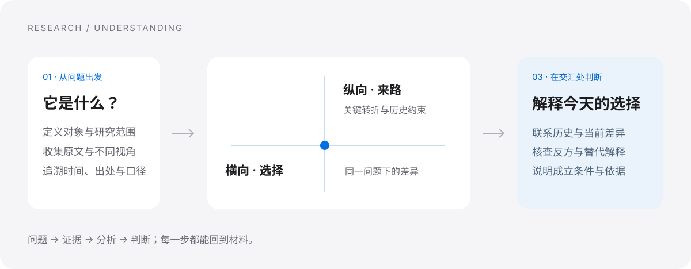
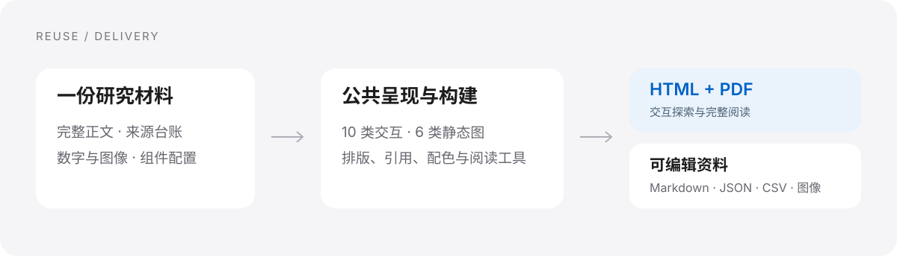

<div align="center">



[](https://github.com/Rolling-Log/orthogonal-research-skill/releases/latest)
[](https://github.com/Rolling-Log/orthogonal-research-skill/actions/workflows/orthogonal-research-skill.yml)
[](LICENSE)

**从产品、公司、行业，到技术、协议与观念。**<br>
追溯它的来路，比较它的选择，形成有依据的理解。

### [下载 Skill ↓](https://github.com/Rolling-Log/orthogonal-research-skill/releases/latest/download/orthogonal-research-skill.zip)　·　[打开交互演示 ↗](https://rolling-log.github.io/orthogonal-research-skill/)

[开始使用](#开始使用) · [研究方法](#怎样把一个对象研究明白) · [本版更新](CHANGELOG.md)

</div>

## 一份研究，两种阅读方式

**网页用于探索，PDF 用于连贯阅读与分享。** 正文、来源和数据共用一份材料，完整论证在两种格式中保留。网页可以筛选、切换、计算和检视；PDF 收录对应的步骤、条件、图表与说明。

<table>
  <tr><th width="66%">HTML · 带着问题探索</th><th width="34%">PDF · 沿着论证阅读</th></tr>
  <tr>
    <td><a href="https://rolling-log.github.io/orthogonal-research-skill/demos/product/report.html"></a></td>
    <td><a href="docs/demos/technology/report.pdf"></a></td>
  </tr>
  <tr><td>目录、搜索、来源跳转、笔记与收藏；桌面和手机均可阅读。</td><td>延续原有中文报告版式，保留完整文字、图解、数据和参考来源。</td></tr>
</table>

以上及下方演示均为**虚构教学样例的真实渲染**。它们展示阅读与交互方式，正式研究的内容由具体问题和实际证据决定。

## 试着动手读一次

<table>
  <tr><th>看清一个部件</th><th>改变一个条件</th><th>查看一段变化</th></tr>
  <tr>
    <td><a href="https://rolling-log.github.io/orthogonal-research-skill/demos/product/report.html#component-product-images"></a></td>
    <td><a href="https://rolling-log.github.io/orthogonal-research-skill/demos/technology/report.html#component-technology-calculator"></a></td>
    <td><a href="https://rolling-log.github.io/orthogonal-research-skill/demos/industry/report.html#component-industry-series"></a></td>
  </tr>
  <tr>
    <td>点选观察位置，放大图片，把结构与文字说明对上。</td>
    <td>调整输入，立即查看明确假设下的计算结果。</td>
    <td>切换显示序列，在图形变化和原始数字之间来回核对。</td>
  </tr>
</table>

| 从哪种问题开始 | 演示中可以做什么 | 打开样例 |
|---|---|---|
| **产品**：一盏灯，如何被维护？ | 检视结构、比较路线、调整维护成本 | [HTML](https://rolling-log.github.io/orthogonal-research-skill/demos/product/report.html) · [PDF](docs/demos/product/report.pdf) |
| **行业**：包装怎样完成循环？ | 查看参与关系、业务序列、条件情景 | [HTML](https://rolling-log.github.io/orthogonal-research-skill/demos/industry/report.html) · [PDF](docs/demos/industry/report.pdf) |
| **技术**：节省资源的代价是什么？ | 逐步理解机制、对照证据、调整参数 | [HTML](https://rolling-log.github.io/orthogonal-research-skill/demos/technology/report.html) · [PDF](docs/demos/technology/report.pdf) |
| **协议**：没有实体的规则如何运作？ | 跟随交换步骤、辨认术语、查看依赖 | [HTML](https://rolling-log.github.io/orthogonal-research-skill/demos/protocol/report.html) · [PDF](docs/demos/protocol/report.pdf) |

## 怎样把一个对象研究明白



**纵向分析**回答“它为什么变成今天这样”：关键转折、条件变化、被放弃的路线，以及留下的约束。**横向分析**回答“它与其他选择有什么不同”：在同一问题、口径和条件下比较。**交汇分析**把两者连起来，解释今天的优势和代价如何形成。

检索按问题展开，核对发布日期、原始出处和不同来源的关系；需要社区体验、视频等材料时，可按需接入 **Agent Reach** 采集层。引用与来源台账随报告交付，读者可以沿着判断回到材料。

## 换一个对象，继续使用同一套能力



组件按**需要解释的问题**组合。产品可以用图片和比较，技术可以用机制和证据，公司可以用时间线和序列；行业、政策、事件和抽象概念也可以组合相同能力。

| 理解任务 | 可复用的组件 |
|---|---|
| 看清变化与差异 | 时间线、对象比较、数据序列 |
| 理解机制与关联 | 分步过程、关系图、术语解释 |
| 检查条件与判断 | 条件情景、证据对照、线性计算器 |
| 观察具体细节 | 图片放大、观察点与文字说明 |

**10 类交互组件 + 6 类静态图表。** 配色、目录、引用、搜索、笔记和响应式布局由公共模板提供。换题时主要更新正文、资料与组件配置；构建程序复用现有代码，不需要模型重新编写整个网页。

默认交付 **PDF + HTML**，另附可编辑 Markdown、结构化 JSON、来源台账与 CSV 数据；也可直接指定单一格式。[了解组件与构建方式 →](orthogonal-research-skill/references/reusable-delivery.md)

## 开始使用

将这段话发给 Codex：

```text
使用 $skill-installer 安装这个 skill：
https://github.com/Rolling-Log/orthogonal-research-skill/tree/main/orthogonal-research-skill
```

也可以下载上方 ZIP，将其中的 `orthogonal-research-skill` 文件夹放入 `~/.codex/skills/`；设置过 `CODEX_HOME` 时放入对应的 `skills/` 目录。

然后直接提出研究任务：

```text
用纵横调研研究无屏手环。我想认识它的产品路线、商业模式、使用体验
与关键争议。保留充分的内容，交付完整 PDF 和可交互网页。
```

```text
用纵横调研研究比特币。从机制和历史讲起，帮助我理解参与者如何协作、
它解决了什么问题，以及不同观点的分歧在哪里。
```

有具体用途、关注方向或阅读对象时，一起说明即可。完整研究默认生成双格式，不必先决定喜欢哪一种。

<details>
<summary>开发与复用</summary>

```bash
python orthogonal-research-skill/scripts/check_package.py
python orthogonal-research-skill/scripts/init_workspace.py --self-test
python orthogonal-research-skill/scripts/build_report.py --self-test
python orthogonal-research-skill/scripts/test_report_components.py
python orthogonal-research-skill/scripts/test_delivery.py
```

[组件契约](orthogonal-research-skill/references/report-components.md) · [复用验证](orthogonal-research-skill/references/reuse-coverage.md) · [版本记录](CHANGELOG.md) · [发布历史](https://github.com/Rolling-Log/orthogonal-research-skill/releases)

</details>

原创内容采用 [MIT](LICENSE)。[第三方许可](THIRD_PARTY_NOTICES.md) · [示例与图像来源](docs/IMAGE_CREDITS.md)
